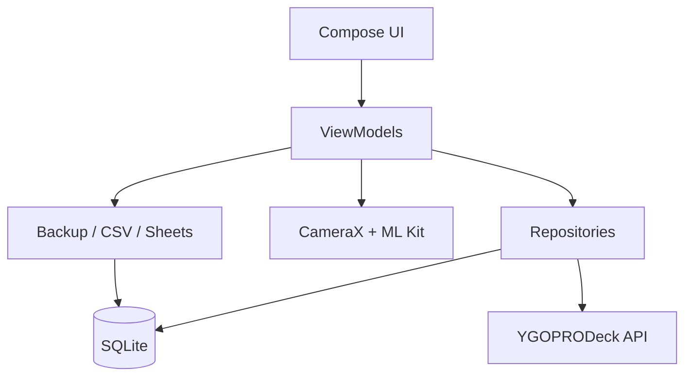

# Architektur

## Android

Die App folgt einem kleinen, expliziten Repository-/ViewModel-Aufbau ohne Dependency-Injection-Framework. `AppContainer` hält die langlebigen Komponenten, die Activity erstellt pro Bereich ein ViewModel.

### Such- und Bildleistung

- Der vollständige Katalog wird in normalisierten SQLite-Tabellen mit Indizes für Name, Typ, Werte und Druckdaten gehalten.
- Alle Filter erzeugen eine parametrisierte SQL-Abfrage und können gleichzeitig aktiv sein.
- Ergebnislisten verwenden `LazyColumn` beziehungsweise `LazyVerticalGrid` mit stabilen Schlüsseln.
- Vorschaubilder nutzen kleinere Thumbnail-URLs und Coil mit 16 % Speicher-Cache sowie 256 MB Festplatten-Cache.
- Es gibt bewusst keine Crossfade-Animation je Zeile; dadurch flackern schnell scrollende Listen nicht.

### Scanner

- CameraX verwendet `STRATEGY_KEEP_ONLY_LATEST`.
- OCR startet höchstens etwa alle 850 ms; parallele Analysen werden verworfen.
- Im Livebild wird nur der lateinische Recognizer verwendet. Galerie-/Kamerafotos werden gründlich mit Latin, Japanisch, Koreanisch, Chinesisch und Devanagari geprüft.
- Ein Ergebnis wird zuerst anhand des Set-Codes, dann des achtstelligen Passcodes und zuletzt des Namens gesucht.
- Ohne konkreten Druck wird eine Karte nicht in der Sammlung gespeichert.

### Sync

- Lokale Daten bleiben die primäre Quelle; Google Sheets ist optional.
- Collection- und Deck-Datensätze tragen stabile UUID, `updatedAt`, `deviceId` und `deleted`.
- Merge: höchster Zeitstempel gewinnt; bei Gleichstand entscheidet die Geräte-ID reproduzierbar.
- `GoogleAuthorizationManager` fordert die Google-Freigabe über den Android-`AuthorizationClient` an.
- Drive-, Drive-Upload- und Sheets-Aufrufe besitzen getrennte REST-Basisadressen.
- `WindowsCloudCodec` liest und schreibt dasselbe private AppData-Backup wie Windows 1.2.7.
- `WindowsSheetTemplate` erzeugt ausschließlich die drei Vorlagen-Reiter und je einen Deck-Reiter.
- API-Tokens werden nur im Arbeitsspeicher gehalten.

## Windows

Der vollständige Windows-1.2.7-Quellbaum bleibt im gemeinsamen Repository unverändert. Beide Plattform-Jobs starten parallel, sobald die gemeinsamen Vertrags- und Regressionsprüfungen erfolgreich waren.
